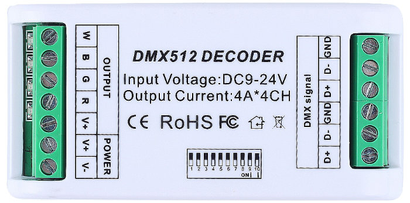

DMX512
======

https://en.wikipedia.org/wiki/DMX512

Written to support DMX lighting controllers for dimmable lights.
The model shown is for controlling RGB LED strip lighting.

DMX512 uses the RS485 physical interface, but a different protocol and usually higher baud rates than MODBUS.
Nevertheless, it is possible to mix difference device types on the same network.

Requests to other devices will generally appear as garbage so shouldn't have any bad side-effects.

.. doxygennamespace:: IO::DMX512
   :members:
