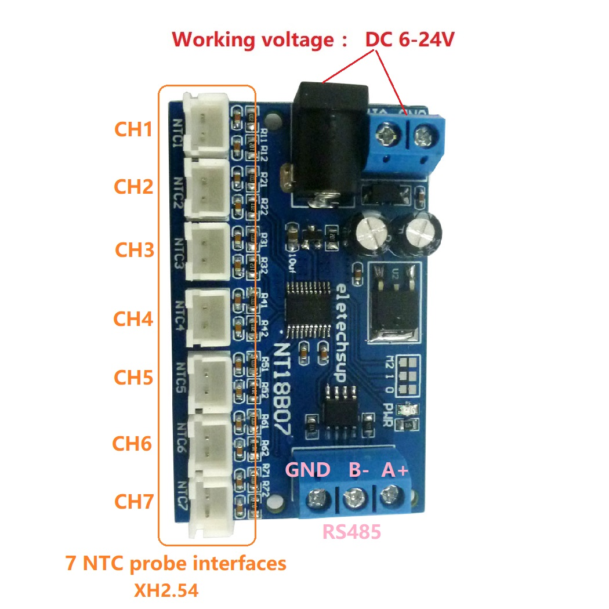

NT18B07 7-channel NTC temperature interface board
=================================================

- Registers 0-6 contain temperature readings in 0.1 degree celcius increments
- Register 254 contains slave ID, R/W, default 1

.. doxygennamespace:: IO::Modbus::NT18B07
   :members:
