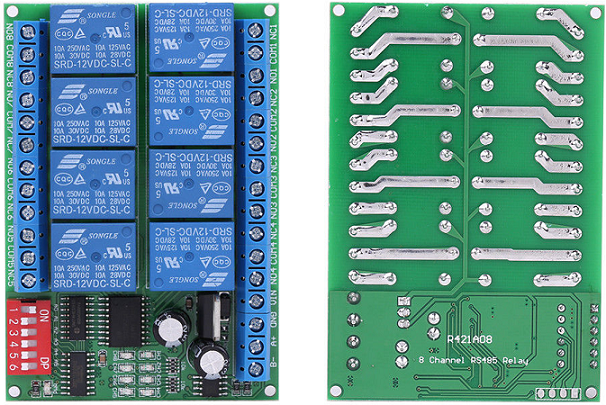

R421A Relay Boards
==================

These are inexpensive and readily available MODBUS multi-channel relay boards.
Both 8 and 4-channel versions have been tested.

Device properties include:

Address
  The address of a modbus slave. Modbus docs. call this the *slave ID*.
Node
  Represents something a slave device does. Modbus relay boards have one node for each output it controls.
Node ID
  The channel a node lives on. For the R421Axx relay boards this is the address or channel number.
  In a modbus transaction this is the address field.

.. doxygennamespace:: IO::Modbus::R421A
   :members:
