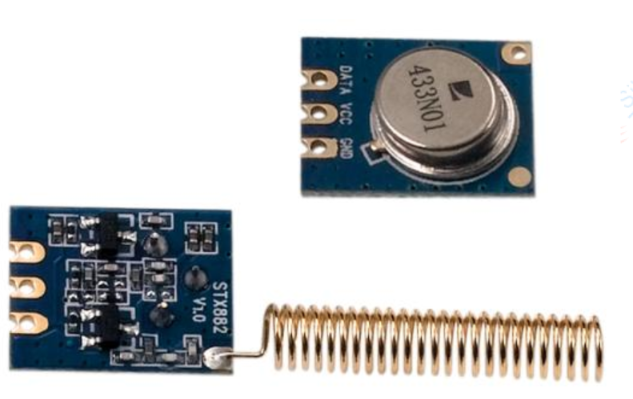

RF Switch
=========

Supports basic 433MHz AM transmitter attached to a GPIO pin via 5v buffer.
You may be able to get away with connecting the GPIO directly and running from 3.3v,
but timing and performance won't be as good.

Uses hardware timer to generate PWM output using interrupts.

Developed for use with i-Lumos lightswitches which use a 24-bit code.
Timing parameters are programmable though so may work with other devices.

.. doxygennamespace:: IO::RFSwitch
   :members:
