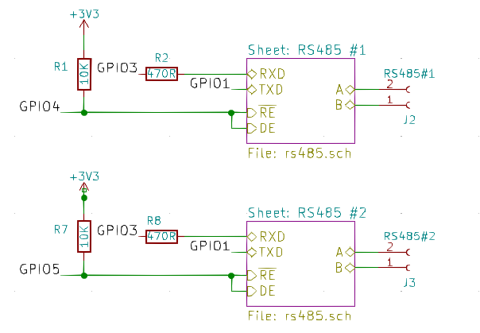
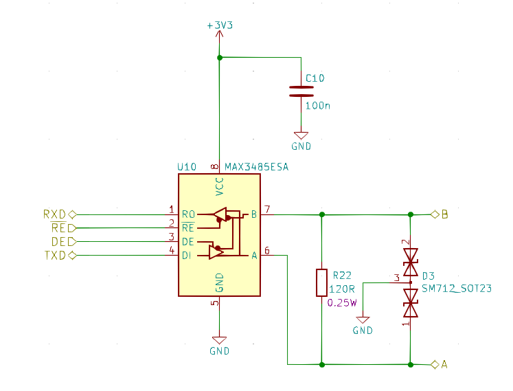

RS485
=====

https://en.wikipedia.org/wiki/RS-485

RS485 is a very inexpensive way to wire devices together in a network.
A single twisted pair (such as two wires from regular UTP network cable)
at low speeds can operate over a kilometre.

Devices must be daisy-chained together, and long runs should be properly terminated
typically with 120 ohm resistors at either end.

Connecting devices in star topology causes signal reflections and generally won't work
except for very short runs.

One solution is to use multiple MAX485 (or similar) transceivers to create multiple
physical network segments. Only one UART is required unless you need concurrent requests.

This example uses GPIO4 and GPIO5 to select which transceiver is going to transmit.
The logic for this would be in a callback registered via :cpp:func:`IO::RS485::Controller::onSetDirection`.

Resistors R2 and R8 are current limit resistors to guard against both transceivers being switched into receive
mode at the same time.

For completeness, here's example connections for a 3.3v transceiver:

R22 is optional, typically installed only on longer runs.
D3 is additional transient protection - always a good idea as a first line of defence even if the transceiver itself has some built in.

.. doxygennamespace:: IO::RS485
   :members:
