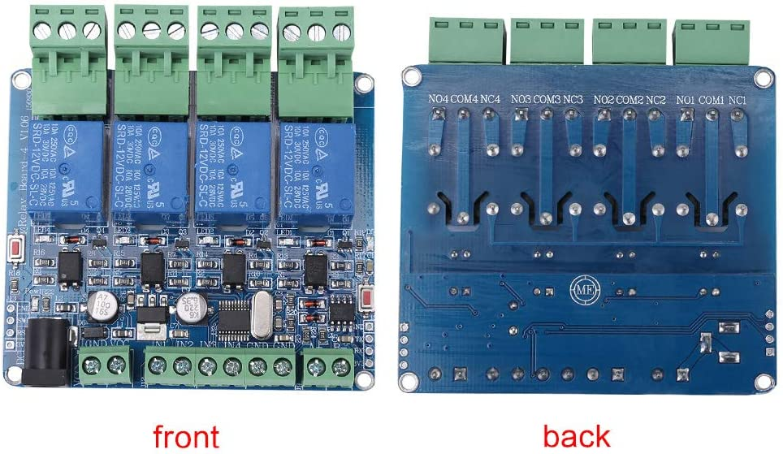

STM8S103 Relay Boards
=====================

General
-------

These are MODBUS multi-channel relay boards with optocouplers and digital inputs.
Advertised as using STM8S103F3 microcontroller, but no model number.
1, 2, 4 and 8-channel versions are available.
Only 4-channel version has been tested.

There are a number of improvements over the cheaper boards (such as R421A):

- Barrel jack power connector provided in addition to screw terminals
- Relays are driven using optocouplers
- Relay outputs use pluggable board connectors
- PCB layout has good electrical isolation between relay outputs and coil side
- Readable digital inputs - 3.3v logic-level, active low, connected directly to microcontroller.
- Programming connections are made available so can be programmed with custom firmware.
- Slave address default is 1, can be changed using custom commands (no DIP switches)

Device properties include:

Address
  The address of a modbus slave. Modbus docs. call this the *slave ID*.
Node
  Represents something a slave device does. Modbus relay boards have one node for each output it controls.
Node ID
  The channel a node lives on.
  In a modbus transaction this is the address field.

Commands
--------

ReadCoil, WriteCoil
  Read or set state of Relays

ReadDiscreteInputs
  Read state of digital inputs. Bits are set to '1' if input is pulled to ground.

ReadHoldingRegister
  Registers must be read individually. Attempting to read multiple registers returns invalid data.
  0x0004 Software month as 2 characters, e.g. "Ap"
  0x0008 Software year in BCD, e.g. 0x2018 for 2018
  0x0010 Software time in BCD, e.g. 0x1459 for 14:59 hrs
  0x0020 Hardware version, e.g. 0x006a
  0x4000 Slave address, typically broadcast (to address #0)

WriteHoldingRegister
  0x4000 Set slave address, typically broadcast (to address #0)

.. doxygennamespace:: IO::Modbus::STM8Relay
   :members:
